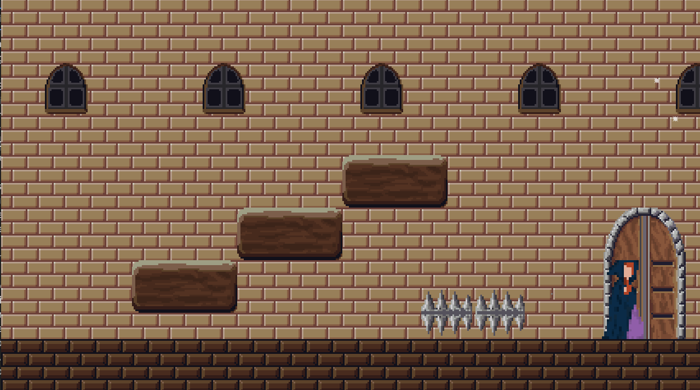

# a maiden's escape

The Wordkeep is a tool to collect words and their definitions using the Merriam-Webster API, allowing users to create their own personal dictionaries.

# Demo



# What's New

- User authentication
- Custom source/notes space for saved words
- Word deletion functionality
- MongoDB database integration

# Built With


# Getting Started

1. Open the URL on itch.io to begin playing: https://ctln-d.itch.io/a-maidens-escape/download/1ey0UQNSIza289Q5ZVsVrE9GYyBDAGd1Z7g0qL9K
2. 

# Contributing

## Cloning and Installation
1. Clone the repo
```
git clone https://github.com/ctln-d/the-wordkeep
```
2. Install and run backend
```
cd backend
npm install
node server.js
```
3. Install and run frontend
```
cd frontend
npm install
npm run dev
```

## Making Contributions
- Make sure to create a new branch and name it adequately
- Write clear commit messages
- When pushing changes, open a pull request and describe the changes made
